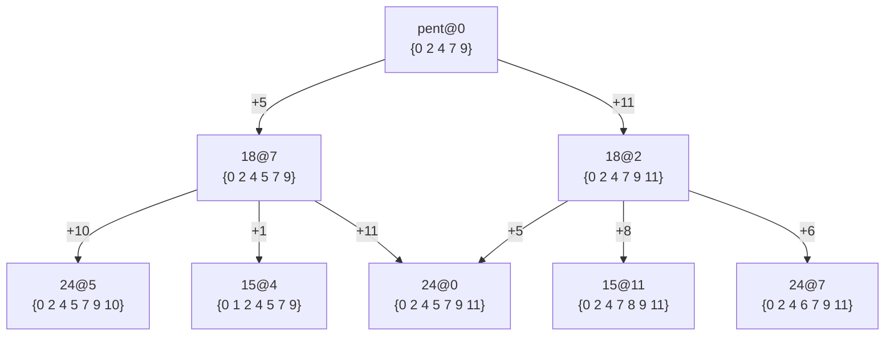

# Composition, Adjacency and Preference
Some large lcms are composed of smaller lcms, while some lcms are close in the sense that their keys mostly overlap. 
Such ambigous structures might give rise to a preference for parsing wave patterns and constructing a perception.

## Adjacent key sets and preference
Assuming the brain does not passively parse incoming sounds but rather looks actively for patterns, we would expect preference for certain patterns.
This could mean that some lcms are preferred over others.
Since most lcms are subsets of each other, certain contexts might cause an "obvious" pattern to be ignored in favor of a preferred pattern.
By looking at subsets of lcms we can gain some insight into these possible competing interpretations.
For this purpose we have the subsets subcommand:

```bash
melodroid table subsets --lcm 15 --at 0 --ktet 12
```

### LCM 24
The lcm 24 subsets produced by dropping a single key from `24@0` = `{0 2 4 5 7 9 11}`
together with the full set look like this (smaller subsets cropped):

| Subset | 0 | 1 | 2 | 3 | 4 | 5 | 6 | 7 | 8 | 9 | 10 | 11 |
| :--- | ---: | ---: | ---: | ---: | ---: | ---: | ---: | ---: | ---: | ---: | ---: | ---: |
| 0 2 4 5 7 9 | 24? | | 90? | | 15? | 24? | | 18? | | 30? | | |
| 0 2 4 5 7 11 | 24? | | 45? | 120? | 30? | | | 36? | | 90? | | |
| 0 2 4 5 9 11 | 24? | 120? | 90? | | 30? | | | 36? | | 90? | | |
| 0 2 4 7 9 11 | 24? | | 18? | | 30? | | | 24? | | 90? | | 15? |
| 0 2 5 7 9 11 | 24? | | 30? | | 30? | | | 36? | | 45? | 120? | |
| 0 4 5 7 9 11 | 24 | | 90? | | 30 | | | 36? | 120 | 40? | | |
| 2 4 5 7 9 11 | 24? | | 90? | | 30? | | 120? | 36? | | 90? | | |
| 0 2 4 5 7 9 11 | 24? | | 90? | | 30? | | | 36? | | 90? | | |

Dropping key 11 produces 18@7 with its accompanying supersets 24@0, 15@4 and 24@5. 

Similarly dropping key 5 produces 18@2 with its accompanying supersets 24@0, 15@11 and 24@7. 

This is expected from the clustered renormalisations we saw previously, where renormalising lcm 18 onto base fraction 16/9 (10 semitones) required a syntonic comma bin radius (~0.6%).
Since 12 tet uses slightly larger bin radius (~1%) it is expected that both lcm 18 subsets show up here.

### LCM 20
The lcm 20 subsets produced by dropping a single key from `20@0` = `{0 3 4 7 8 10}`
together with the full set look like this (smaller subsets cropped):

| Subset | 0 | 1 | 2 | 3 | 4 | 5 | 6 | 7 | 8 | 9 | 10 | 11 |
| :--- | ---: | ---: | ---: | ---: | ---: | ---: | ---: | ---: | ---: | ---: | ---: | ---: |
| 0 3 4 7 8 | 20 | | | 60 | 40 | 40? | | 15 | 40 | | | 60 |
| 0 3 4 7 10 | 20? | | 45? | 60 | | 72? | | 15 | 40? | | | 120 |
| 0 3 4 8 10 | 20? | 120? | | 30 | | 120? | | 15 | 40? | | | 120 |
| 0 3 7 8 10 | 10? | | | 12 | | 90? | | 15 | 8? | | 9? | 120 |
| 0 4 7 8 10 | 20? | | | 60 | | 120? | | 15 | 40? | 120? | | 120 |
| 3 4 7 8 10 | 20? | | | 60 | | 120? | 120? | 15 | 40? | | | 120 |
| 0 3 4 7 8 10 | 20? | | | 60 | | 120? | | 15 | 40? | | | 120 |

Since 20@0 is a subset of 15@7 we always find it when dropping a key.

Dropping key 4 however produces 8@8. 
In some contexts perhaps lcm 20 could be perceived as 8@8 with a bad key 4.

Of further interest is the symmetric aug chord 0 4 8 present in 20@0. 
Any implications based on structures in 20@0 could then be functionally true for 20@4 and 20@8 as well.

For instance the 8@8 subset would imply adjacency to 8@0,4 as well. 
While we will cover melody later on, notably playing the fractions 15/8 and 9/8 per modulated 8@0,4,8 produces interesting melody with aug@0.

### LCM 18
The lcm 18 subsets produced by dropping a single key from `18@0` = `{0 2 5 7 9 10}`
together with the full set look like this (smaller subsets cropped):

| Subset | 0 | 1 | 2 | 3 | 4 | 5 | 6 | 7 | 8 | 9 | 10 | 11 |
| :--- | ---: | ---: | ---: | ---: | ---: | ---: | ---: | ---: | ---: | ---: | ---: | ---: |
| 0 2 5 7 9 | 18? | | 30? | | 15? | 24? | | 18? | | 15? | 24? | |
| 0 2 5 7 10 | 18? | | 15? | 24? | | 18? | | 30? | | 15? | 24? | |
| 0 2 5 9 10 | 9? | 120 | 10? | | | 12 | | 90? | | 15 | 8? | |
| 0 2 7 9 10 | 18? | | 30? | | | 24? | | 90? | | 15? | 24? | 120 |
| 0 5 7 9 10 | 18? | | 30? | | | 24? | | 45? | 120 | 15? | 24? | |
| 2 5 7 9 10 | 18? | | 30 | | | 24? | 120 | 40? | | 15? | 24 | |
| 0 2 5 7 9 10 | 18? | | 30? | | | 24? | | 90? | | 15? | 24? | |

We saw earlier from the clustered renormalisations that 18@k is a subset of 24@k+5,k+10 and 15@k+9.
Indeed we see those full matches here.

Dropping key 7 produces 8@10. Perhaps 18@k is musically closest to 8@k+10 out of all the lcm 8 families.

Dropping key 9 produces the pentatonic major scale at 10 - pent@10 = `{0 2 5 7 10}`. 
This is a subset of 18@5 and adding in key 3 completes 18@5.
Since 18@k is adjacent to 18@k+5 via pent@2 we could call this pentatonic adjacency. 
Such adjacency might be the reason for the circle of fifths.


### LCM 15
The lcm 15 subsets produced by dropping a single key from `15@0` together with the full set look like this (smaller subsets cropped):

| Subset | 0 | 1 | 2 | 3 | 4 | 5 | 6 | 7 | 8 | 9 | 10 | 11 |
| :--- | ---: | ---: | ---: | ---: | ---: | ---: | ---: | ---: | ---: | ---: | ---: | ---: |
| 0 1 3 5 8 9 | 15 | 40? | | | 120 | 20? | | | 60 | | 120? | |
| 0 1 3 5 8 10 | 15? | 24? | | 18? | | 30? | | | 24? | | 90? | |
| 0 1 3 5 9 10 | 15? | 120? | 120? | | | 60? | | | 120? | | 120? | |
| 0 1 3 8 9 10 | 15? | 120? | | | | 60? | | | 120? | | 120? | 120? |
| 0 1 5 8 9 10 | 15? | 120 | | | | 60 | | | 120? | 120 | 40? | |
| 0 3 5 8 9 10 | 15? | 120? | | | | 60? | | 45? | 120? | | 72? | |
| 1 3 5 8 9 10 | 15? | 120? | | | | 60? | 120? | | 90? | | 120? | |
| 0 1 3 5 8 9 10 | 15? | 120? | | | | 60? | | | 120? | | 120? | |

Dropping key 10 we see the subset 20@5.

Dropping key 9 we see 18@3 with its supersets 24@1,8.

### Non-lcm key sets
Some non-lcm key sets are of interest due to traditional popularity or notable structural features.

#### Dim7
The symmetric chord dim7 (0 3 6 9) consists of four dim chords, each prominent in lcm 15 and 24:

| Subset | 0 | 1 | 2 | 3 | 4 | 5 | 6 | 7 | 8 | 9 | 10 | 11 |
| :--- | ---: | ---: | ---: | ---: | ---: | ---: | ---: | ---: | ---: | ---: | ---: | ---: |
| 0 3 6 | | 24? | 60? | 15 | 40? | 30? | | 120 | 20? | | 45? | 60 |
| 0 3 9 | 15 | 40? | 30? | | 120 | 20? | | 45? | 60 | | 24? | 60? |
| 0 6 9 | | 120 | 20? | | 45? | 60 | | 24? | 60? | 15 | 40? | 30? |
| 3 6 9 | | 45? | 60 | | 24? | 60? | 15 | 40? | 30? | | 120 | 20? |
| 0 3 6 9 | | 120? | 60? | | 120? | 60? | | 120? | 60? | | 120? | 60? |

Notably dim@x has supersets of 24@x+1 and 15@x+3.

A single dim7 thus points equally at the four families 24@1,4,7,10 (and 15@0,3,6,9). 
Perhaps this ambiguity of subsets is why the dim 7 sounds both consonant yet tense.

#### Harmonic Minor
[The harmonic minor scale](https://en.wikipedia.org/wiki/Harmonic_minor_scale) at 0 (harm@0) = `{0 2 3 5 7 8 11}` is not itself an LCM family but popular in classical music and produces a nice coherent style of melody, 
whereas the similar 15@2 instead sounds dissonant when playing key 10.

Dropping a single key (via `melodroid table subsets --keys 0 2 3 5 7 8 11 --ktet 12`) gives these subsets:

| Subset | 0 | 1 | 2 | 3 | 4 | 5 | 6 | 7 | 8 | 9 | 10 | 11 |
| :--- | ---: | ---: | ---: | ---: | ---: | ---: | ---: | ---: | ---: | ---: | ---: | ---: |
| 0 2 3 5 7 8 | 90? | | | 24? | 120? | 90? | | 30? | | | 36? | |
| 0 2 3 5 7 11 | 120? | | 15? | 120? | 120? | | | 60? | | | 120? | |
| 0 2 3 5 8 11 | 120? | 120? | | 120? | 120? | | | 60? | | | 120? | |
| 0 2 3 7 8 11 | 40? | | | 120 | 40? | | | 60 | | | 120? | 60 |
| 0 2 5 7 8 11 | 120? | | | 120? | 60? | | | 60? | | 120? | 120? | |
| 0 3 5 7 8 11 | 120 | | | 120? | 120 | | | 60? | 120 | | 90? | |
| 2 3 5 7 8 11 | 120? | | | 120? | 120? | | 120? | 60? | | | 60? | |
| 0 2 3 5 7 8 11 | 120? | | | 120? | 120? | | | 60? | | | 120? | |

We see that harm@0 is adjacent to 15@2 and 24@3. 
If we were to look at smaller subsets still we would find 18@5 along with 24@10 as well.

Perhaps harmonic minor is best thought of as a composition of other lcm families, providing rapid modulation between notes.

#### Blues
[The blues scale](https://en.wikipedia.org/wiki/Blues_scale#Hexatonic) at 0 (blues@0) is `{0 2 3 4 7 9}`.
Dropping a single key (via `melodroid table subsets --keys 0 2 3 4 7 9 --ktet 12`) gives these subsets together with
the full set:

| Subset | 0 | 1 | 2 | 3 | 4 | 5 | 6 | 7 | 8 | 9 | 10 | 11 |
| :--- | ---: | ---: | ---: | ---: | ---: | ---: | ---: | ---: | ---: | ---: | ---: | ---: |
| 0 2 3 4 7 9 | 120? | | 90? | | 120? | 72? | | 90? | | | | 60? |
| 0 2 3 4 7 | 40? | | 45? | 120 | 40? | 72? | | 30 | | | | 60 |
| 0 2 3 4 9 | 120? | 120? | 90? | | 120? | 72? | | 90? | | | | 60? |
| 0 2 3 7 9 | 90? | | 30? | | 120? | 36? | | 90? | | | 24? | 60? |
| 0 2 4 7 9 | 24? | | 18? | | 15? | 24? | | 18? | | 30? | | 15? |
| 0 3 4 7 9 | 60 | | 90? | | 120 | 40? | | 45? | 120 | | | 60? |
| 2 3 4 7 9 | 120? | | 90? | | 120? | 72? | 15? | 90? | | | | 60? |

Dropping key 4 the blues scale is adjacent to 24@10.

Dropping key 3 (the blue note) it is adjacent to 18@7 with supersets 24@0,5 and 15@4, as well as 18@2 with supersets 24@7,0 and 15@11.
The set produced is another popular traditional non-lcm scale: the pentatonic major pent@0 = `0 2 4 7 9`.

Dropping key 0 it is adjacent to 15@6. This could imply being functionally perceived as 18@9 with the corresponding 24@7,2

Blues is perhaps similarly to harmonic minor a set useful for rapid modulation between adjacent sets.

#### Pentatonic Major
The pentatonic major pent@0 = `0 2 4 7 9` is a subset of some interesting supersets. The results from the key-supersets command are illustrated as a graph below:



We see that  pent@0 = `{0 2 4 7 9}` = 18@2 $\cap$ 18@7 = 15@4 $\cap$ 15@11 = 24@5 $\cap$ 24@7.

We can also note there are circles of fifths at the lcm levels of 15, 18 and 24.
This is a consequence of 18@k being adjacent to 18@k+5, which could also explain the classical cadence of V -> I: 
The I chord is perceived as the 18@k+5 subset and moving to it is causes a resolving feeling as the "extraenous" key k+9 is removed.

Perhaps since pent@0 is related to 24@0 via both its supersets 18@2 and 18@7 
it can be thought of as a 24@0 core with the possibility of resolving into 24@5 with key 10 or 24@7 with key 6, both keys uniquely shared with their respective placements.

### Concluding Remarks
TODO: are the non-lcm key sets usefull sets by virtue of the progression principles?
Some sets of keys will have beneficial traits such as easily modulating between sets with the principles, producing stable lcm placements and avoiding sour notes via preference.

By removing a single key from large lcm sets we could often recover lcm subsets, notably 18@k with supersets 24@k+5,k+10 and 15@k+9.
Conversely we can think of these subsets as being ambigous between which top level set they represent, and adding distinguishing keys help settle our perception.

#### On Chord Progressions
The adjacency relations between voiced keys and possible placements illustrates that an important relationship between lcms might not just be shared lcm **supersets**, but shared lcm **subsets**,
i.e. lcm 18 being shared between lcm 15 and 24.
Such relationships might motivate chord progressions via superset and subset principles:
* Superset Principle - Chord A can progress to chord B if A shares an lcm **superset** with B.
* Subset Principle - Chord A can progress to chord B if A shares an lcm **subset** with B.

A motivation for the superset principle could be that two subsequent chords are voicings of the same placement and placements govern perception.
The superset principle has a nice directness to it, moving straight up/down in the lcm family hierarchy.

A motivation for the subset principle feels less straightforward. Perhaps the brain recognizing that two subsequent chords, while not in the same lcm family, share a subset is good enough.
One also wonders to what extent such supersets are allowed as there are a lot of dyads which can serve as shared subsets.
Looking back at the lcm family chapter, notably lcm 8 and 18 are the big bridging families, and perhaps these subsets are privileged or preferred when identifying shared subsets.

A concrete example of the superset principle for the chord progression C to Eb (4@0 -> 4@3):
* C is part of 15@7 (4@0 $\cong$ 3@7), Eb = 4@3 is part of 18@10.
* Placement 15@7 is an lcm superset of 18@10.
* Both C and Eb then share the superset 15@7 and the superset principle thus allows the progression.

In this way, although `{0 4 7}`(3@7) is not a subset of `{0 3 5 7 8 10}`(18@10) since they do not share key 4,
it is still possible to move to 18@10 since 3@7 is part of its superset lcm family 15@7.

A concrete example of the subset principle for the chord progression C to Db (4@0 -> 4@1): 
* C is part of 15@7 (4@0 $\cong$ 3@7), Db = 4@1 is part of 24@8.
* Placements 15@7 and 24@8 are both lcm supersets of 18@10.
* The subset principle thus allows a progression from 3@7(15@7) to 4@1(24@8) via the shared subset 18@10.

We should also note what is meant by an allowed progression - indeed there is no physical law denying any two chords from being played after another. 
Progressions as motivated by principles instead guarantee that there is some physically motivated pattern which the brain could find and trigger a reward for finding, thus eliciting reproducible emotions.

#### On Preference
Faced with a multitude of ambigous interpretations of frequencies, the brain might employ heuristic preference and collapse competing possibilities under certain circumstances.
One such case could be the ambiguity between lcm 24 and 15, where 15@k is adjacent to 24@k+1,k+8 via 18@k+3.

As we heard in the "Voicings and LCM Families" section, key k+8 in 15@k sounds dissonant (last note in the arpeggio) even though technically being part of 15@k.
This might be because the brain prefers lcm 24 over 15.
Stated as a principle:

* Preference Principle - Perception favors lcm 24 over 15, choosing the former over the latter in ambigous contexts.

It might identify 18@k+3 and try to fit the sounded keys into either 24@k+1 or 24@k+8. 
Key k+8 might simply be a distinguishing key for 24@k+1,k+8 - perhaps by virtue of being the root or smallest fraction (perfect fifth, 3/2) of those placements.
Key k+8 then collapses 15@k, leaving key k+9 as a note extraenous to the lcm 24 placements, perceived as a sour or false note.

Perception then might be governed by pragmatic subsets, e.g. lcm 4, 8 and 18, which are expanded with distinguishing keys to collapse a decision space of possible perceptions based on placements.

This could be true even for non-lcm key sets, such as dim7, harmonic minor, blues and the pentatonic scale.

#### On Dim7
Dim7 consists of multiple dim triads, each with dim@k having supersets of 24@k+1 and 15@k+3, and so playing e.g. key k+1 and k+10 could focus our perception on 15@k.

#### On Harmonic Minor
Harmonic minor harm@k could be thought of as 18@k+5.
Consider the adjacent pair 15@2 and 24@3, which share the subset 18@5:

* 18@5 = `{0 2 3 5 7 10}`
* 15@2 = 18@5 $\cup$ `{11}` — distinguishing key **11**
* 24@3 = 18@5 $\cup$ `{8}` — distinguishing key **8**

Harm@0 takes the subset `{0 2 3 5 7 10}` (18@5) and adds **both** distinguishing keys while removing the collapsing key 10:

harm@0 = `{0 2 3 5 7}` $\cup$ `{8, 11}` = `{0 2 3 5 7 8 11}`

Key 8 is 24@3's distinguishing note, 15@2's key is 11 — harm@0 then plays with the ambiguity between 15@2 and 24@3.

This also explains why harm@0 is less dissonant than plain 15@2:
15@2 still contains the collapse key 10, which forces preference toward 24@3 or 24@10, leaving a sour note 11.
Harmonic minor removes 10, leaving enough ambiguity to not force a sour note.

The set `{0 2 3 5 7}` = 18@5 $\cap$ `{10}` is the **minor pentachord**. It is also the **Jins Nahawand** in arabic maqam theory.

#### On Blues
TODO: check out "Rock & Roll Flat-Key Borrowing (Modal Interchange)" which apparently involves the set `{I, IV, V, bIII, bVII, bVI}`,
where `{I, IV, V}` is from 24@0(0 4 7) and `{bIII, bVII, bVI}` is from 24@10(0 3 7), sharing 4@5 as a subset, allowing the subset principle to explain the movement.

TODO: relate to pentatonic, e.g. pent@0 is adjacent to 18@2,7. Blues is adjacent to 18@9,2,7. Adding in the blue note to pent@0 pulls to the 18@9, related to pent@7.


The same mechanism of dual distinguishing keys as in the harmonic minor case is at work in blues, but across a pair of lcm 24 families rather than a 15/24 pair.

As we saw in the subset analysis, blues@0 was adjacent to penta@0 with its supersets 18@7 and 18@2. 
Blues@0 is also adjacent to 15@6 which is a superset of 18@9, hinting that perhaps it is also related to penta@2 or penta@7.

This is quite reasonable as we saw a circle of fifths relationship for the pentatonic majors via their lcm 18 supersets - penta@2->penta@7->penta@0.

--- deferred below

TODO: clean up slop, also investigate 0 3 7 6 with the dual adjacency.

blues@0 = `{0 2 3 4 7}` holds *both* thirds: the major third 4 (the `{0 2 4 7}` $\subseteq$ 8@0 $\subseteq$ 24@0 home) and the blue third 3 (the `{0 2 3 7}` $\subseteq$ 18@5 $\subseteq$ 24@10).
So the blue note is precisely the distinguishing key that swings the parse into 24@10 while a major triad still asserts 24@0, and the swing between the two is the blues feel (developed further in [On Blues](#on-blues) below).

concluding slop -
The three sets above are all instances of one idea, which we might call *double adjacency*: a non-lcm set that sits between good families by holding the *distinguishing* key of each neighbour at once, while shedding the key they collapse on. They differ only in which families they straddle:

* **dim7** — the symmetric fourfold limit, straddling 24@1,4,7,10 (each dim triad a consonant subset of a different family).
* **harmonic minor** — a 15/24 pair (15@2 and 24@3, sharing subset 18@5).
* **blues** — a 24/24 pair a whole step apart (24@0 and 24@10, via the two thirds).

In each case the residual tension is a dim7, and the "feel" of the scale is the ear swinging between the co-present interpretations rather than resting in one — matching the intuition that these are sets for rapid modulation between adjacent families.

old text -
There seems to be a phenomena where there is a large difference of perception between a major vs. minor (or even dim or blues) chord feel when a 15@x placement includes or excludes note x+8.

As we saw in the example for 15@0 it is adjacent to 24@1,8, and key 8 is the root for 8@8 but also for 12@8 (8@1).
Including it in lcm 15 perhaps forces a choice between an lcm 15 or 24 perception, with 24 being preferred, even though all notes technically could be parsed as lcm 15. 
The resulting dissonance might be due to experiencing 24@1 or 24@8, neither of which contains key 9, causing it to sound out of key.

The key sets for 24 and 15 are quite similar, which is to be expected as they both share a subset of lcm 18,
with 15@k being adjacent to 24@k+1,k+8 via 18@k+3 and conversely 24@k being adjacent to 15@k+4,k+11 via 18@k+2 by only dropping one key from each set.

#### On Blues
When playing a major chord 0 4 7 the blues note 3 could perhaps work via a pull to 24@10.
Blues@0 is adjacent to 15@2 which collapses on key 10, indeed the major chord 7 11 2 playing blues using key 10 works well together with 0 4 7 using key 3.
There is also a similar bluesy feel of playing a 7 chord e.g. 0 4 7 10 where the 10 fits well with the 24@10 pull feel idea.

Practically this could mean that one should perhaps think blues@x as modulating between 8@x+10, and 8@x+3 - the isomorphic groups constituting 24@x+10.

Blues@x is also related to harm@x+4 via 15@6 - playing e.g. a major@x with note x+3 for blues, followed by minor@x+9 also with not x+3 to imply harm@4 sounds quite good. 

#### On Harmonic Minor
The harmonic minor scale could be the result of ambiguity between 15@x and 24@x+1, similar to blues@x and 24@x+10.

#### On composition and perception
Perhaps the larger lcms are not only perceived as themselves, but can be perceived as their constituents. 
Certain musical feels or styles could be an exploitation of this ambiguity, e.g. the swinging motion of blues could be a pull from one perceived placement to another due to ambigous interpretations.

Such ambiguity might interact with the human capacity for auditory streams, e.g. cocktail party effect and auditory scene analysis.
If so, some musical feels are perhaps dependent on having multiple interpretations and are thus intrinsically complex.

In this way, perhaps adjacency is an instructive way of looking at the ambiguity of harmonic structures,
allowing us to modulate between constituent parts, respecting some seemingly arbitrary preferences of the musical brain.