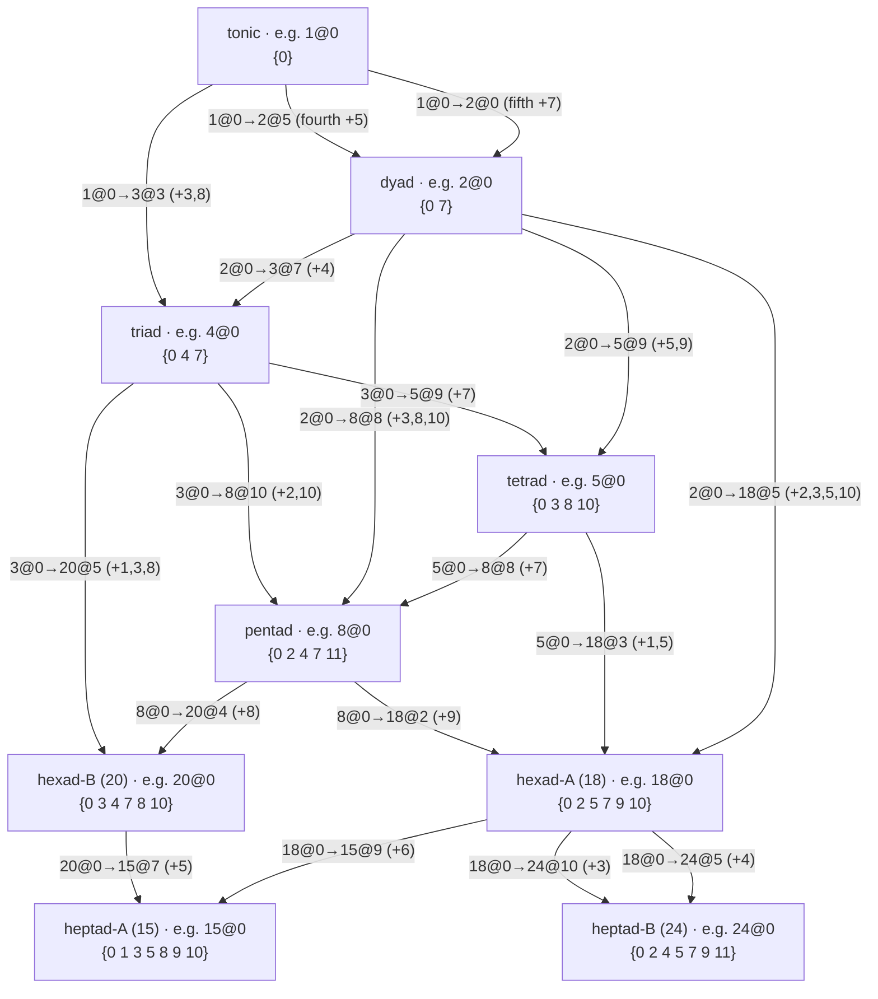
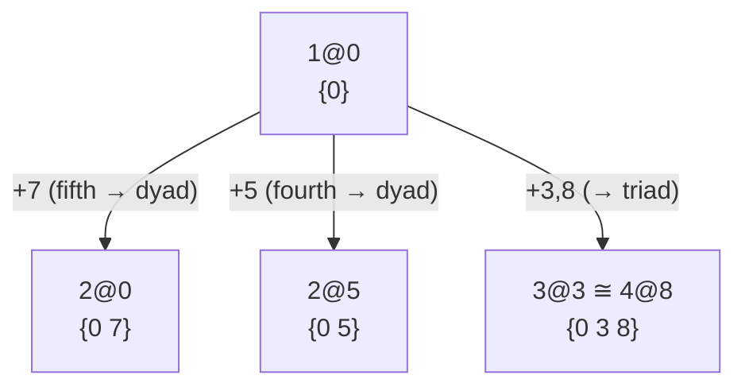
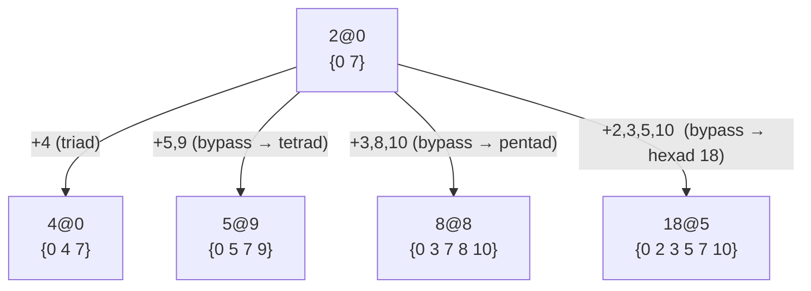
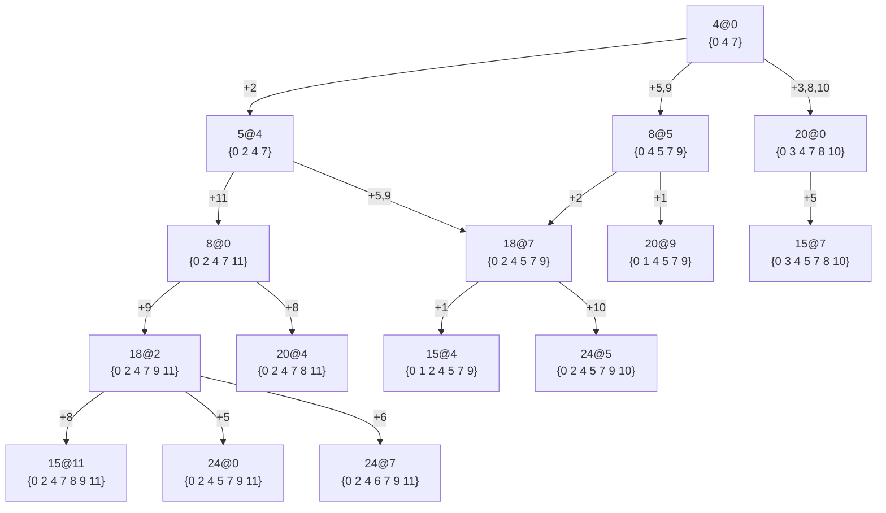

# Placements

We now have a $k$-TET tuning that can sound every full match, so we can start making music and
testing the model by ear. For the good fractions of max size 24 and max prime 5, 12 TET is the
tuning of choice.

In a 12 TET tuning the reference point of an LCM family full match maps to a key. We write a full match
of LCM $a$ with reference on key $b$ as $a@b$ (e.g. $24@0$) and call it a **placement** of the
LCM at key $b$.

Counting pitch C as key 0 lets us borrow familiar terms: $24@0$ is the C major scale, $4@7$ is
the G major chord.

Running

```bash
melodroid table placement --lcm 4 --at 0 --ktet 12
```

prints `4@0` (keys `0 4 7`, the C major triad). Option `--at 7` gives `4@7` (keys `7 11 2`, G major).
Pass multiple LCMs — `--lcm 3 5 15 --at 0` — to render one row per LCM at the same anchor, handy
for comparing isomorphic placements.

## Overlapping Key Sets
A set of keys might overlap between lcm families. Running e.g.

```bash
melodroid table key-supersets --keys 0 4 7 --ktet 12
```

lists every placement whose keys contain the C major triad. The `Extra` column lists the keys a
placement adds beyond the requested set (empty = exact fit); rows sort by (extra count, LCM,
key). A few highlights from `{0, 4, 7}`:

| LCM | Key | Keys (12-tet)    | Extra      |
| --: | --: | :--------------- | :--------- |
|   3 |   7 | 7 0 4            |            |
|   4 |   0 | 0 4 7            |            |
|   8 |   0 | 0 2 4 7 11       | 2 11       |
|  12 |   0 | 0 4 5 7 9        | 5 9        |
|  15 |   7 | 7 8 10 0 3 4 5   | 8 10 3 5   |
|  24 |   0 | 0 2 4 5 7 9 11   | 2 5 9 11   |

The isomorphic `3@7` and `4@0` fit exactly; each larger family that contains the triad pads it
out with more keys, up to the full C major scale at `24@0`.

## Tonic Placement Structure
Now that we have defined placements, we can express the lcm family graph from lcm families as placements.

Given the tonic (key 0), we can list all placements which contain it by running

```bash
melodroid table key-supersets --keys 0 --ktet 12 --collapse
```

(The `--collapse` flag folds placements that cover the same keys, down from 63 placements to 41)

We can collapse even further by using lcm families.

As noted earlier there are 9 classes of lcm families.
The 9 families correspond to a tonic (lcm 1), a dyad (lcm 2), a triad (lcm 3,4), a tetrad (lcm 5,6), the pentad (lcm 8,9,10,12), two different hexads (lcm 18,20), and two different heptads (lcm 15,24).

Since each family has a specific **shape** (keys relative to a root), this reduces the whole structure to just **9 shapes** and **18 distinct relationships** between them.
(Every placement of a given shape is a transposition of every other — all six lcm-20 placements are one shape, all seven lcm-15 are one shape, and so on.)

The following graph shows all 18 relationships at once, one per edge. Each node is a shape (with one
example placement shown), each edge is labelled by a single representative placement pair, and every
other placement of that shape realises the same relationship transposed.



We can illustrate these 18 relationships with three **shape graphs**, one for each shape from the tonic upward. 

* A shape graph starts with a shape as root and then branches into **directly adjacent** shapes via **distinguishing keys**.
* Two shapes are **adjacent** if the larger shape contains the smaller shape. The distinguishing keys are the unshared keys.
* Two shapes are directly adjacent if they are adjacent, and there is no third shape adjacent to both.

The tonic branches only into the two dyads and one triad; 
the dyad adds branches which leap straight past the triad into larger families;
everything whose source is a triad or larger shape lives inside a single triad graph.

### The Tonic Graph



The tonic is directly adjacent only to the two dyads `2@0`/`2@5` and the triad `3@3`.

### The Dyad Graph



The mirror dyad `2@5` carries the identical branch shifted +5 (`5@2`, `8@1`, `18@10`). These
bypass scales still climb into the same upper families (`5@9 → 18@0`, `8@8 → 20@0`,
`18@5 → 15@2`), so the dyad can reach every heptad without ever sounding a triad along the way.

### The Triad Graph



The triad graph contains every relationship whose source is a triad
or a larger shape (tetrad → pentad → hexad → heptad, and the lcm-20 branch), so no separate tetrad,
pentad or hexad graph is needed.

(`5@4` also reaches `18@7`; `20@9` and `20@4` also cover `15@4` and `15@11`, drawn here via `18@7`
and `18@2`.) The `4@5` and `3@3` branches are this same graph shifted +5 and +8, and the lcm-5
placements are the `5@4 → …` sub-branch of the +8 copy, so none of them are redrawn.

This tonic structure linking the different lcm placement shapes could be the foundation for scales and chord progressions.