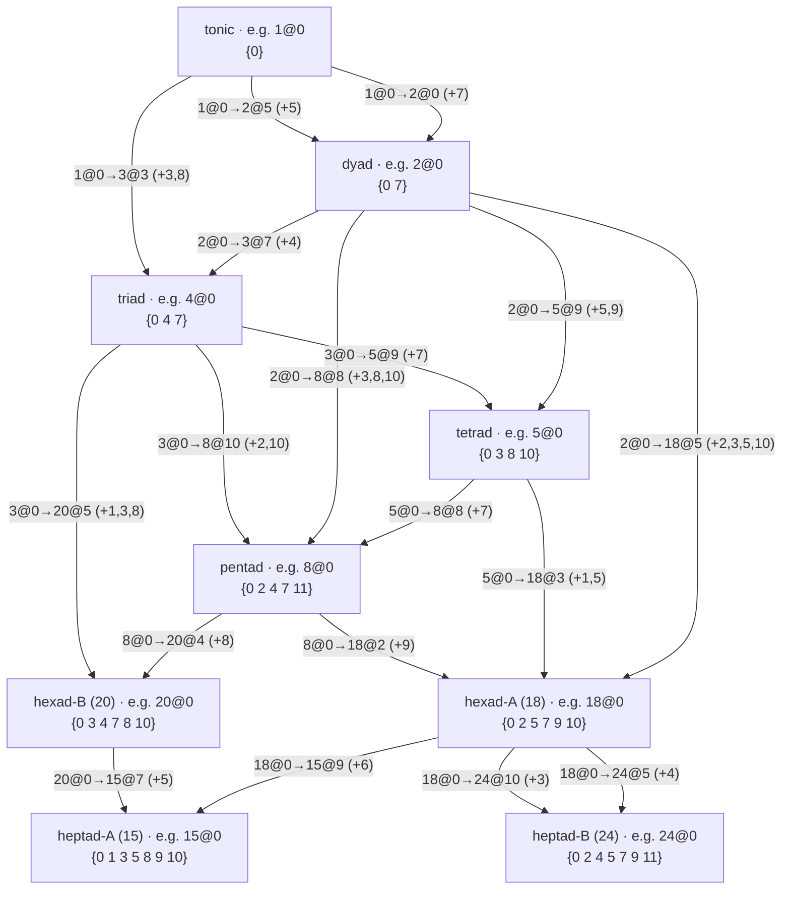
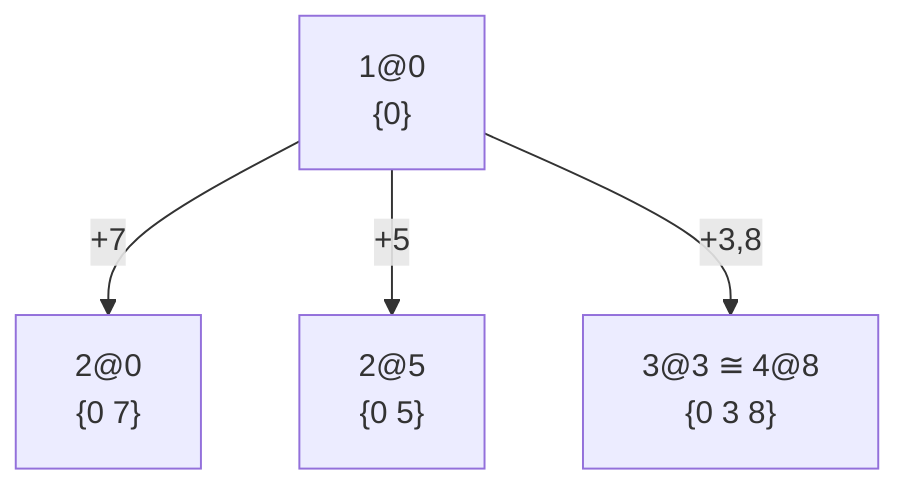
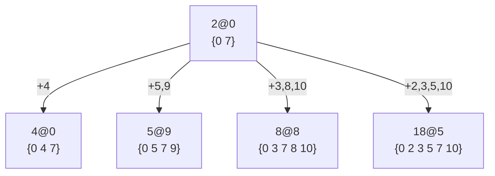
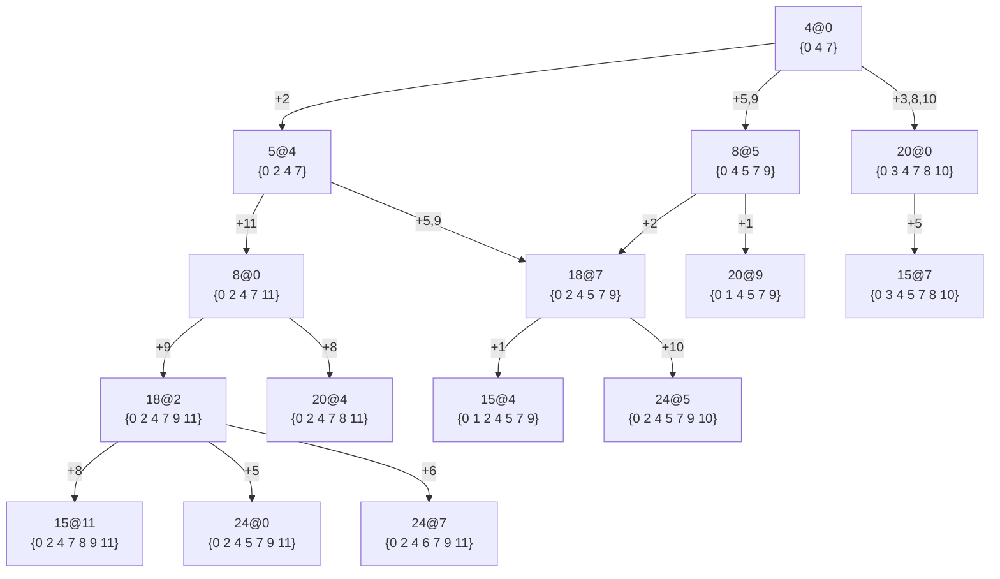

# Placements

We now have a $k$-TET tuning that can sound every full match, so we can start making music and
testing the model by ear. For the good fractions of max size 24 and max prime 5, 12 TET is the
tuning of choice.

In a 12 TET tuning each key is the reference point of several LCM family full matches. We write a full match
of LCM $a$ with reference on key $b$ as $a@b$ (e.g. $24@0$) and call it a **placement** of the
LCM at key $b$.

Counting pitch C as key 0 lets us borrow familiar terms: $24@0$ is the C major scale, $4@7$ is
the G major chord.

Running

```bash
melodroid table placement --lcm 4 --at 0 --ktet 12
```

prints `4@0` (keys `0 4 7`, the C major triad). Option `--at 7` gives `4@7` (keys `7 11 2`, G major).
Pass multiple LCMs — `--lcm 3 5 15 --at 0` — to render one row per LCM at the same anchor, handy
for comparing isomorphic placements.

## Overlapping Key Sets
A set of keys might overlap between lcm families. Running e.g.

```bash
melodroid table key-supersets --keys 0 4 7 --ktet 12
```

lists every placement whose keys contain the C major triad. The `Extra` column lists the keys a
placement adds beyond the requested set (empty = exact fit); rows sort by (extra count, LCM,
key). A few highlights from `{0, 4, 7}`:

| LCM | Key | Keys (12-tet)    | Extra      |
| --: | --: | :--------------- | :--------- |
|   3 |   7 | 7 0 4            |            |
|   4 |   0 | 0 4 7            |            |
|   8 |   0 | 0 2 4 7 11       | 2 11       |
|  12 |   0 | 0 4 5 7 9        | 5 9        |
|  15 |   7 | 7 8 10 0 3 4 5   | 8 10 3 5   |
|  24 |   0 | 0 2 4 5 7 9 11   | 2 5 9 11   |

The isomorphic `3@7` and `4@0` fit exactly; each larger family that contains the triad pads it
out with more keys, up to the full C major scale at `24@0`.

## Shapes and Adjacency
Now that we have defined placements, we can express the lcm family graph from lcm families as placements.

Given the tonic (key 0), we can list all placements which contain it by running

```bash
melodroid table key-supersets --keys 0 --ktet 12 --collapse
```

The `--collapse` flag folds placements that cover the same keys, down from 63 placements to 41.

We note that not only is the tonic contained in each of the placements listed, but that some placements contain each other.
For instance 0 is in 0 7 and 0 4 7, but 0 7 is also in 0 4 7.

* Two key sets are **adjacent** if the larger key set contains the smaller key set. The unshared keys are called **distinguishing keys**.
* Two key sets are **directly adjacent** if they are adjacent, and no third key set contained by the larger key set also contains the smaller key set.

We also note that several supersets have identical shapes; 2@0 and 2@5 are both a fifth with intervals `{0 7}`, while 3@3 and 4@0 are both triads with intervals `{0 4 7}`.

* Two key sets have the same **shape** if their key sets are equal under transposition modulo 12.

Example transposed sets with the same shape:
* 4@0: root 0, intervals `{0,4,7}` → `{0, 4, 7}` = `{0 4 7}`
* 4@8: root 8, intervals `{0,4,7}` → `{8, 0, 3}` = `{0 3 8}`
* 3@3: root 3, intervals `{0,5,9}` → `{3, 8, 0}` = `{0 3 8}`

Adding 8 to all intervals of 4@0 or 4 to all intervals of 4@8, 3@3 produces equal key sets.

We can then express the supersets of the tonic as shapes and their containment relationships.

### Shape and Placement Graphs
As noted earlier there are 9 classes of lcm families.

The 9 families correspond to shapes; a tonic (lcm 1), a dyad (lcm 2), a triad (lcm 3, 4), a tetrad (lcm 5, 6), the pentad (lcm 8, 9, 10, 12),
 two different hexads (lcm 18 and lcm 20), and two different heptads (lcm 15 and 24).

This reduces the tonic superset structure to just 9 shapes and 18 distinct containment relationships between them.

The following graph shows all 18 relationships at once, one per edge. Each node is a shape (with one
example placement shown), each edge is labelled by a single representative placement pair, and every
other placement of that shape realises the same relationship transposed.



We can illustrate these 18 containments with placement graphs, one for each shape from the tonic upward.

* A **placement graph** is a graph showing a placement and all of its directly adjacent placements.

Since shapes constitute classes of placements, we can choose a representative placement to illustrate a shape.
For instance, the tonic placement graph is shown below:



The dyad `2@0` is shown below:



Interestingly, the triad placement graph can be extended to include the higher order placement graphs:



This extended triad placement graph contains every relationship whose source is a triad
or a larger shape (tetrad → pentad → hexad → heptad, and the lcm-20 branch), so no separate tetrad,
pentad or hexad graph is needed.

This tonic structure linking the different lcm placement shapes could be the foundation for scales and chord progressions.