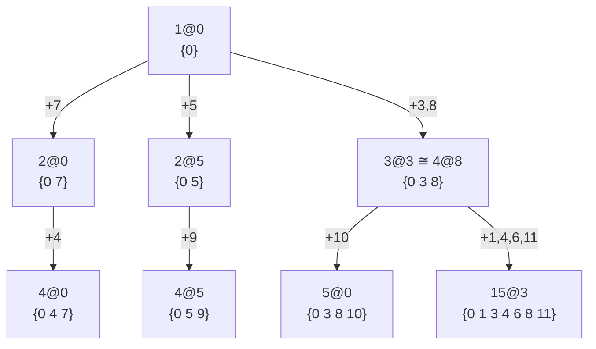
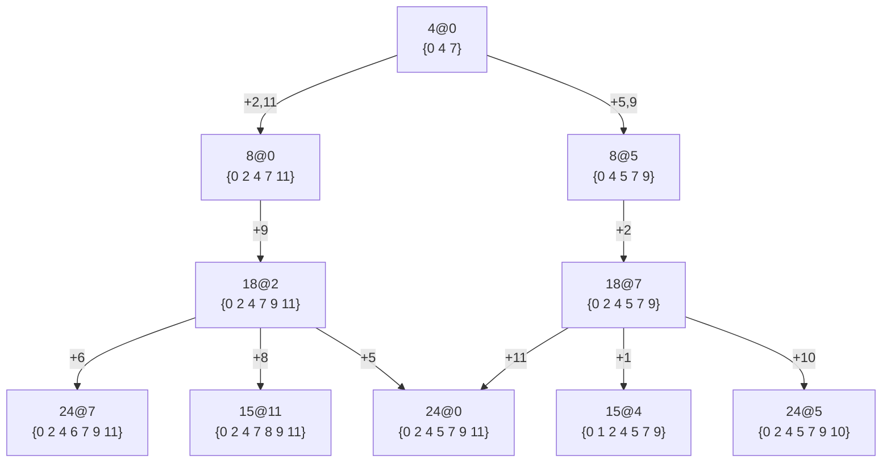
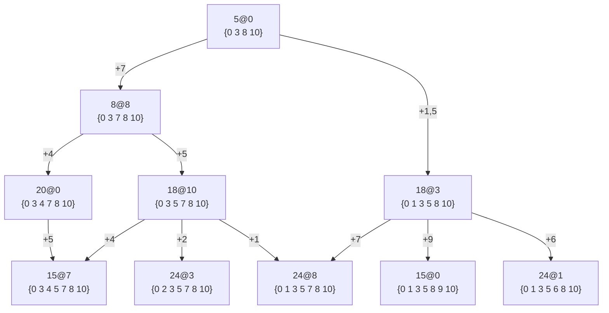
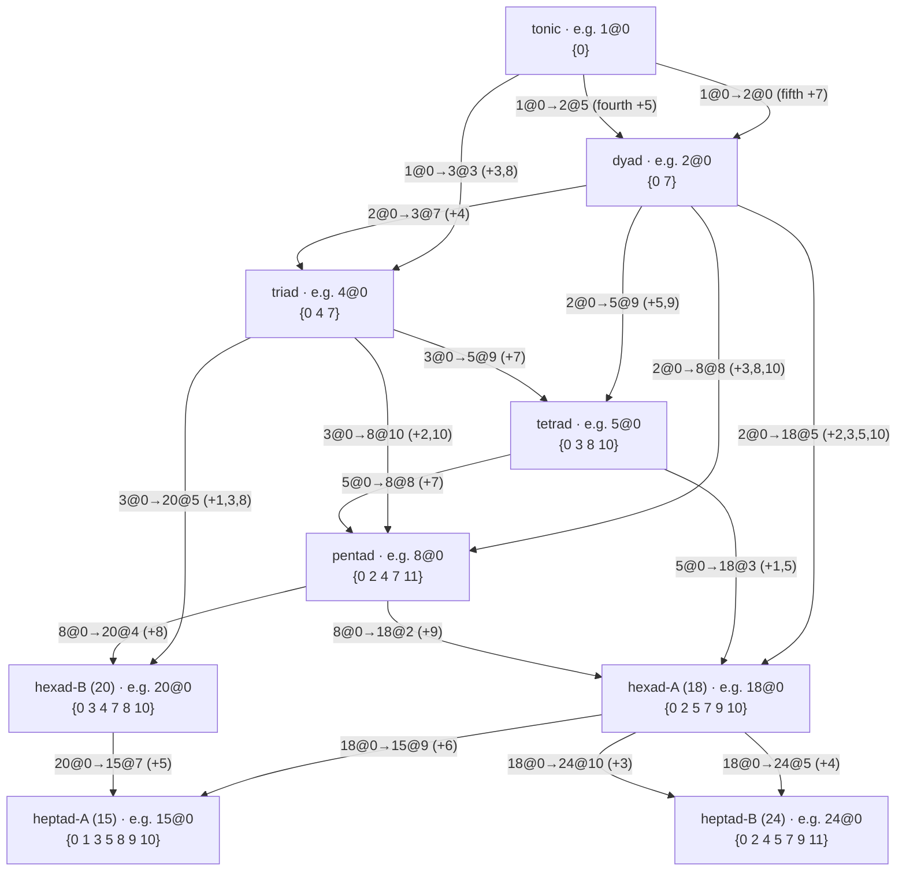
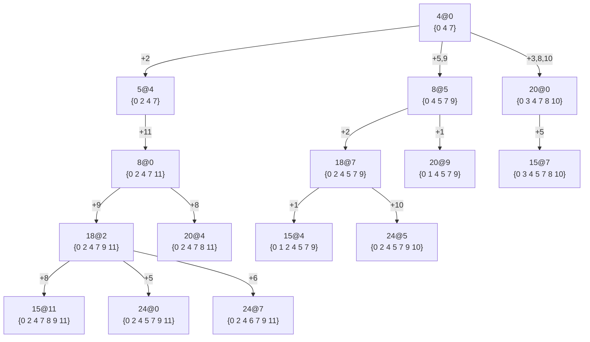
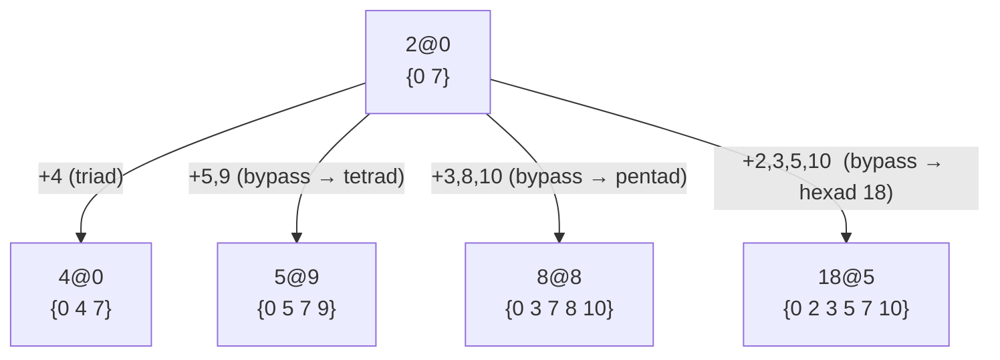

import Player from '@site/src/components/Player';

# Voicings and Placements

We now have a $k$-TET tuning that can sound every full match, so we can start making music and
testing the model by ear. For the good fractions of max size 24 and max prime 5, 12 TET is the
tuning of choice.

## Placements

In a 12 TET tuning the reference point of an LCM family full match maps to a key. We write a full match
of LCM $a$ with reference on key $b$ as $a@b$ (e.g. $24@0$) and call it a **placement** of the
LCM at key $b$.

Counting pitch C as key 0 lets us borrow familiar terms: $24@0$ is the C major scale, $4@7$ is
the G major chord.

Sometimes we must be explicit about the shape of a chord. We call this a **Voicing**, e.g. "$24@0$ voiced as `{7 11 2 5 9 0 4}`" is the G13 chord. 
This can help alleviate some dissonance from adjacent keys (e.g. `{0,1}` vs. `{0,13}`) or make the chord more playable by hand.

<Player keys={[0, 1]} label="▶ Close semitone {0, 1}" />
<Player keys={[0, 13]} gain={0.8} label="▶ Spread minor ninth {0, 13}" />

Neither sounds pleasant in a sustained tone, but the close semitone produces very audible beating effects as well.

Running

```bash
melodroid table placement --lcm 4 --at 0 --ktet 12
```

prints `4@0` (keys `0 4 7`, the C major triad). Option `--at 7` gives `4@7` (keys `7 11 2`, G major).
Pass multiple LCMs — `--lcm 3 5 15 --at 0` — to render one row per LCM at the same anchor, handy
for comparing isomorphic placements.

## Overlapping Key Sets
A set of keys might overlap between lcm families. Running e.g.

```bash
melodroid table key-supersets --keys 0 4 7 --ktet 12
```

lists every placement whose keys contain the C major triad. The `Extra` column lists the keys a
placement adds beyond the requested set (empty = exact fit); rows sort by (extra count, LCM,
key). A few highlights from `{0, 4, 7}`:

| LCM | Key | Keys (12-tet)    | Extra      |
| --: | --: | :--------------- | :--------- |
|   3 |   7 | 7 0 4            |            |
|   4 |   0 | 0 4 7            |            |
|   8 |   0 | 0 2 4 7 11       | 2 11       |
|  12 |   0 | 0 4 5 7 9        | 5 9        |
|  15 |   7 | 7 8 10 0 3 4 5   | 8 10 3 5   |
|  24 |   0 | 0 2 4 5 7 9 11   | 2 5 9 11   |

The isomorphic `3@7` and `4@0` fit exactly; each larger family that contains the triad pads it
out with more keys, up to the full C major scale at `24@0`.

### Tonic Placement structure
Given the tonic (key 0), we can see all placements which contain it by running

```bash
melodroid table key-supersets --keys 0 --ktet 12 --collapse
```

The `--collapse` flag folds placements that cover the same keys (isomorphic families sweep out
identical key patterns) down to the lowest-LCM representative, so the hierarchy shows up without
redundancy, down to 41 placements from 63. From that we can illustrate the placement hierarchy:



Notably the tonic is only directly adjacent to 2@0,5 and 3@3 - any other placement is either isomorphic to these or contains one of them.
Already at this low level we see a circle of fiths relationship via the tonic with 4@5 -> 4@0 via the tonic.
There is also the possibility of a circle of fourths, with 4@8 -> 4@0 via the tonic.

From lcm 4 the placement hierarchy looks like this:



Here we see circle of fifth relationships on all levels of 8, 15, 18 and 24.

From lcm 5 it looks like this:



The structure is quite similar to the lcm 4 placement hierarchy, only adding in an lcm 20 intermediary.
Notably the lcm placement graph is almost identical to an lcm4@8 graph, probably since 5@0 is a superset of 4@8.
Walking a circle of fifths by repeating 4@0 -> 4@5 we could reach 4@8 in 4 steps.

### The complete relationship structure

The three graphs above are illustrative rather than exhaustive. If we collapse the 41 tonic
placements by **transposition** — treating placements that are the same shape shifted around the
keyboard as one — the whole structure reduces to just **9 shapes** and **18 distinct
relationships** between them. The 9 shapes are the tonic, the dyad, the triad, the tetrad, the
pentad, *two* different hexads (the lcm-18 family and the lcm-20 family are genuinely different
shapes), and *two* different heptads (lcm-15 and lcm-24). Every placement of a given shape is a
transposition of every other — all six lcm-20 placements are one shape, all seven lcm-15 are one
shape, and so on.

Seen this way, the graphs above already cover 14 of the 18 relationships. The `4@5` branch is just
the lcm-4 graph shifted **+5** (the circle of fifths), and the `3@3` branch is the lcm-4 graph
shifted **+8** — with the lcm-5 graph being a sub-branch of that +8 copy. They add no new
*relationship*, only transposed repeats, which is why we need not redraw them.

The following graph shows all 18 relationships at once, one per edge. Each node is a shape (with one
example placement shown); each edge is labelled by a single representative placement pair, and every
other placement of that shape realises the same relationship transposed.



Exactly **four** of these relationships are missing from the illustrative graphs above. Three are
the dyad reaching straight into a larger family *without passing through a triad*
(`2@0 → 5@9`, `2@0 → 8@8`, `2@0 → 18@5`), and the fourth is a triad reaching an lcm-20 hexad
(`3@7 → 20@0`), the lcm-20 branch that the lcm-4 graph pruned away. We surface them concretely
below.

First, the **completed lcm-4 graph** — the full `4@0` up-set, restoring the tetrad step `5@4` and
the lcm-20 branch (`4@0 → 20@0 → 15@7`, `8@0 → 20@4`) so the `triad → hexad(20)` relationship
appears:



(`20@9` and `20@4` also cover `15@4` and `15@11`, drawn here via `18@7` and `18@2`.) The `4@5` and
`3@3` branches are this same graph shifted +5 and +8, and the lcm-5 graph is the `5@4 → …`
sub-branch of the +8 copy, so none of them are redrawn.

Second, the **dyad-direct** graph — the dyad `2@0` branching straight into the tetrad, pentad and
lcm-18 hexad, shown next to the ordinary `2@0 → 4@0` triad path for contrast:



The mirror dyad `2@5` carries the identical branch shifted +5 (`5@2`, `8@1`, `18@10`). These
bypass scales still climb into the same upper families (`5@9 → 18@0`, `8@8 → 20@0`,
`18@5 → 15@2`), so the dyad can reach every heptad without ever sounding a triad along the way.