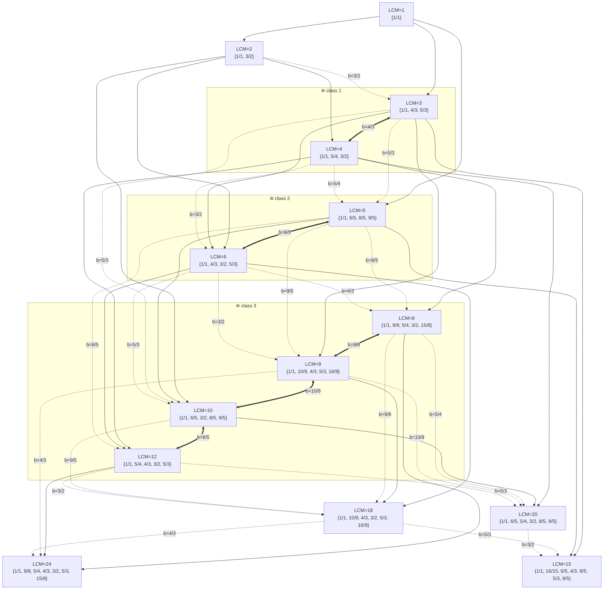
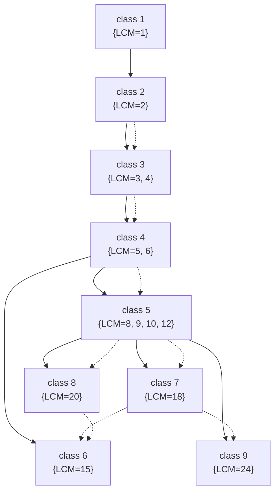

import Player from '@site/src/components/Player';

# LCM Families

Given a set of [good fractions](../intro.mdx), we can compute the LCM of the denominators of any
non-empty subset — this LCM is the **wave pattern length** for that subset. For a given LCM $L$,
the maximal subset of the good fractions whose denominators have LCM exactly $L$ is the **LCM
family** of size $L$.

For example, the LCM-4 family is the major chord $\{1,\ 5/4,\ 3/2\}$:

<Player fractions={[1, 1.25, 1.5]} label="▶ LCM 4 — {1, 5/4, 3/2}" />

## How the families relate

Some families are naturally subsets of others. LCM 4 $\{1,\ 5/4,\ 3/2\}$ is a literal subset of
LCM 8 $\{1,\ 9/8,\ 5/4,\ 3/2,\ 15/8\}$:

<Player
  fractions={[1, 1.125, 1.25, 1.5, 1.875]}
  label="▶ LCM 8 — {1, 9/8, 5/4, 3/2, 15/8}"
/>

Because music is octave-equivalent, some families are subsets only after **renormalising** to a
new base (LCM 18 renormalised to base $4/3$ becomes a subset of LCM 24), and some are entirely
**isomorphic** (LCM 4 renormalised to base $3/2$ is exactly LCM 3 $\{1,\ 4/3,\ 5/3\}$):

{/* Rooted at 220·3/2 = 330 Hz so the pitch classes match the LCM 4 example above. */}
<Player
  fractions={[1, 1.3333333333333333, 1.6666666666666667]}
  fundamental={330}
  label="▶ LCM 3 — {1, 4/3, 5/3}"
/>

The graph below shows all three relations between families computed with `--max-size 24`,
`--max-prime 5`, up to `--max-lcm 24`:

- **solid arrow** (`-->`) — literal subset: $F_A \subseteq F_B$ as sets;
- **thick double arrow** (`<==>`) — isomorphism: some base $b \in F_A$ makes the renormalisation
  of $F_A$ equal $F_B$ exactly (the edge label gives the base);
- **dashed arrow** (`-.->`) — renormalised proper subset: some base $b$ makes the renormalisation
  of $F_A$ a strict subset of $F_B$.

Edges are Hasse-reduced per relation (transitive edges of the same kind are omitted), and
isomorphic families are grouped into subgraph clusters.

In a more concise, collapsed form, each node is one isomorphism class (singletons included), and
class-to-class edges are deduplicated and Hasse-reduced per kind:

From this we see that all LCM families pool into either the odd-length LCM 15 or even length LCM 24.

{/*
Regenerating this graph: this diagram is the output of `melodroid graph lcm-families` (which writes
`output/graphs/lcm-families.md`). When the relation logic changes, regenerate and re-paste the
Mermaid block above.
*/}
